<a id="chinese"></a>

[English](#english) | [中文](#chinese)

# Coolder

**Coolder 是一个本地部署、通过浏览器使用的 AI 编程智能体。** 它将大模型、项目上下文、代码操作工具、构建验证和变更审核整合到同一个工作台，让用户以自然语言描述需求，在真实项目中完成代码理解、功能开发、问题修复和迭代维护。

Coolder 围绕项目执行任务：读取与搜索源码、生成多文件修订，在隔离草稿中尝试构建和修复，再由用户审核并写入正式项目。应用采用 **C++17 + ACL 协程 HTTP 服务 + 原生 Web 前端**，核心编程能力由可独立复用的 **libai** 静态库提供。

**阅读导航：** [运行截图](#运行截图) · [架构设计](#架构设计) · [推理机制](#智能体推理机制) · [功能组成](#功能组成) · [快速开始](#快速开始) · [任务实践](#任务实践) · [常见问题](#常见问题) · [开发文档](#开发验证与文档)

## 核心特点

- **面向真实项目**：创建项目脚手架，或导入工作区内或已授权的本地目录与 Git 仓库，结合项目索引、计划和会话持续开发。
- **模型与工具协同**：智能体根据任务调用文件读取、搜索、代码大纲、补丁和验证工具，依据执行结果继续推进。
- **构建反馈驱动修复**：增量修订在隔离草稿中进行构建检查，编译诊断反馈给模型，支持“修改—验证—修复”循环。
- **变更可审查**：AI 修订先保存在修订区，支持差异预览、逐项接受或拒绝，以及批量接受并写入项目。
- **多模型接入**：支持 OpenAI compatible、OpenAI Chat、OpenAI Responses、Anthropic、Gemini 和 Ollama 协议。
- **账户与策略管理**：管理员统一配置模型、用户、语言工具、并发额度和执行限制；各账户拥有独立工作区。
- **轻量浏览器工作台**：集成 Monaco 编辑器、项目文件浏览、会话、任务进展和差异审核；前端构建不需要 npm，编辑器资源由本机提供。

## 运行截图

以下截图来自 macOS 上独立启动的 Coolder 演示实例，使用中文界面、演示账户和 `hello-coolder` 项目。任务输入尚未提交给模型；代码编辑与差异为手动操作示例。

### 项目工作台

左侧管理项目与会话，中间输入编程任务，右侧浏览项目文件，并可切换查看变更和工具记录。

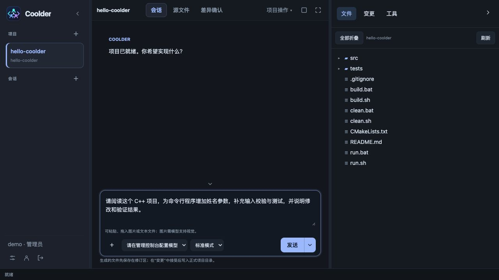

### 代码编辑

在工作台内直接编辑 C++ 源码，使用语法高亮、文件标签、查找替换和差异预览。

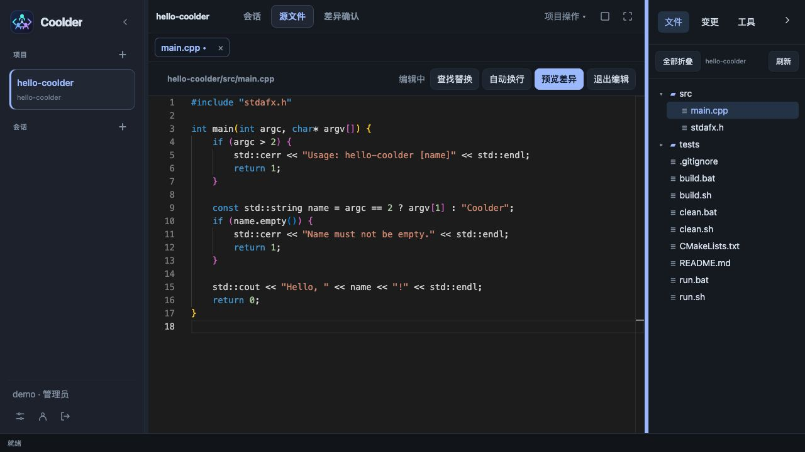

### 差异确认

手动编辑后先查看新增与删除的内容，再选择返回修改或确认保存。此图展示的是手动编辑审核流程。

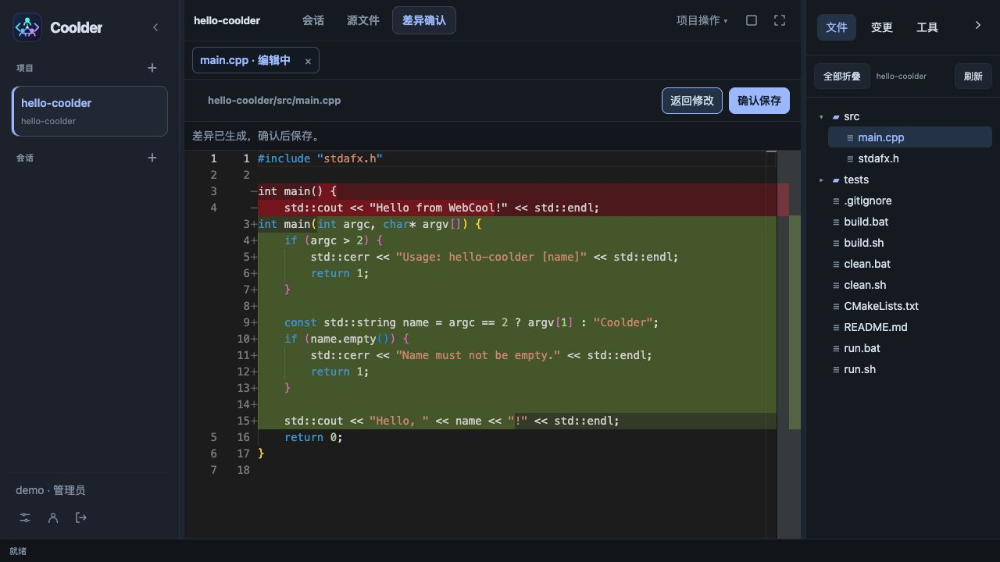

### 管理控制台

管理员集中管理用户、智能体策略和模型厂商；图中展示智能体开关与角色权限设置。

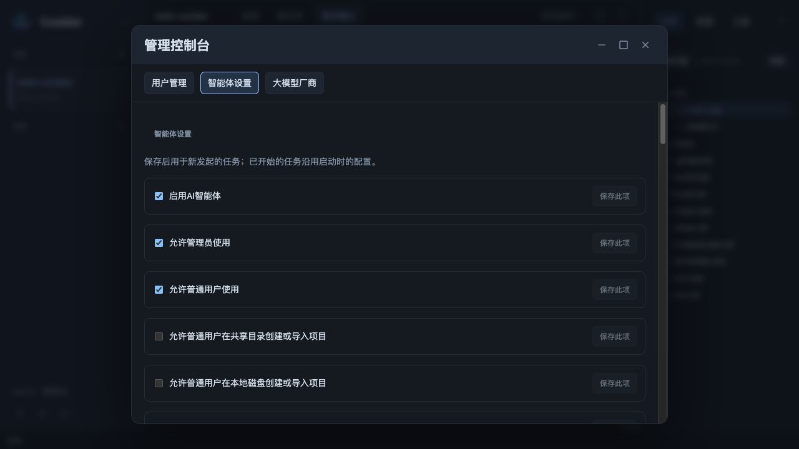

## 架构设计

### 分层架构

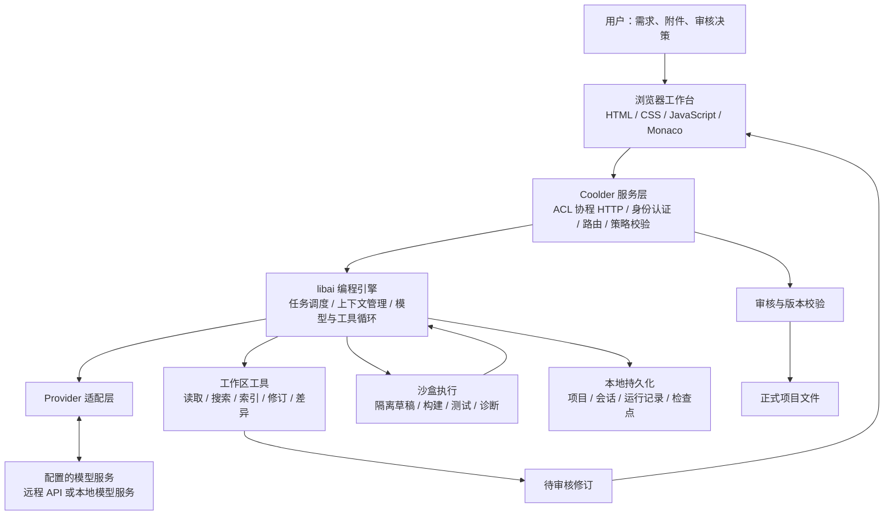

| 层次 | 主要组成 | 职责 |
| --- | --- | --- |
| 浏览器工作台 | `coolder/html/` | 项目与会话交互、文件编辑、任务状态展示、差异审核、个人设置和管理控制台 |
| 应用宿主 | `coolder/main.cpp`、`coolder/server/` | 服务启动、账户认证、工作目录分配、Host/Origin 校验、角色权限与 HTTP 分发 |
| 业务接口 | `coolder/action/ai/` | 将模型配置、项目、会话、任务、文件和审核操作适配为 `/api/v1/ai/` 接口 |
| 智能体引擎 | `libai/agent/`、`libai/runtime/` | 执行模式、任务调度、模型与工具循环、暂停、取消、恢复和后台执行 |
| 模型与上下文 | `libai/provider/`、`libai/context/`、`libai/prompt/` | 模型协议适配、流式响应处理、上下文组装与压缩、读取覆盖和提示词管理 |
| 项目与工作区 | `libai/project/`、`libai/workspace/` | 项目元数据、脚手架、索引、规划、受限文件操作、补丁、差异和审核状态 |
| 执行与验证 | `libai/sandbox/`、`libai/validation/` | 沙盒执行边界、构建与测试证据、提案验证和修复收敛 |
| 状态存储 | `libai/storage/` | 会话、运行记录、检查点、草稿、结果和工作流的本地持久化 |

### 设计原则

**宿主与引擎分离。** Coolder 负责浏览器界面、HTTP、账户和项目目录授权；libai 负责模型、工具、工作区及任务运行时。宿主鉴权后显式传入用户目录、模型配置和执行策略，核心库不依赖 Coolder 的 HTTP 实现，可供其他 C++ 应用链接使用。

**以执行反馈推进任务。** 模型输出的工具调用经过权限和额度检查后执行，读取结果、编译诊断和验证报告进入后续上下文。运行时结合上下文压缩、调用预算和无进展控制约束任务循环。

**将代码生成与正式写入分开。** AI 修改先形成可持久化的修订，并在隔离草稿中验证。用户接受修改时，服务端检查文件版本与哈希，避免直接覆盖任务期间发生的外部编辑。

**本地保存状态，模型按配置调用。** 项目、账户和运行状态保存在本机；使用远程模型时，任务所需的代码与上下文会发送给所选服务。管理员须明确启用模型并允许向其发送项目代码。

### 一次编程任务如何执行

1. **建立任务**：用户选择项目、会话、模型和执行模式，提交需求及可选附件。
2. **准备上下文**：运行时结合项目资料、会话历史、检查点和工具读取结果组装模型输入。
3. **调用工具**：模型按需读取目录与源码、搜索符号、查看代码大纲，提出文件修改或调用验证能力。
4. **生成修订**：新增或修改的内容保存在修订区，并物化到隔离草稿供后续工具使用。
5. **验证与修复**：具备相应工具链和沙盒能力时，运行时执行构建检查，将失败诊断反馈给模型继续修复；完整验收按任务和验证能力执行。
6. **审核写入**：用户查看结果与差异，逐项接受、拒绝，或批量接受并写入正式项目。
7. **继续迭代**：会话和运行记录保留，用户可以继续提出需求；异常中断可由运行时利用检查点恢复，具体恢复由状态查询触发。

“生成完成”可能仍表示有修订等待审核，尚未写入项目；构建成功也不等于全部测试通过或需求已完成，应结合验证报告与实际使用结果判断。

## 智能体推理机制

Coolder 采用 **ReAct 风格的模型与工具循环，并结合构建验证和自动修复**：模型根据当前证据决定下一步，运行时负责执行动作、反馈结果和约束任务。这是对实现方式的概括，不表示项目依赖某个同名框架。

### 模型决策与运行时控制

| 层次 | 职责 |
| --- | --- |
| 模型推理 | 理解需求、分析源码、形成修改方案、选择工具，并根据执行结果调整方案 |
| 运行时控制 | 组装上下文、检查权限与预算、执行工具、维护隔离草稿、触发验证、检测无进展和保存检查点 |
| 用户审核 | 检查结果与差异，决定哪些修订写入正式项目 |

主执行路径围绕单个任务所选模型展开逐轮决策，没有独立的规划、实现、评审模型协作调度，也没有多候选方案搜索树。部分读取工具可以并行执行，但工具并行不等于多个智能体并行推理。

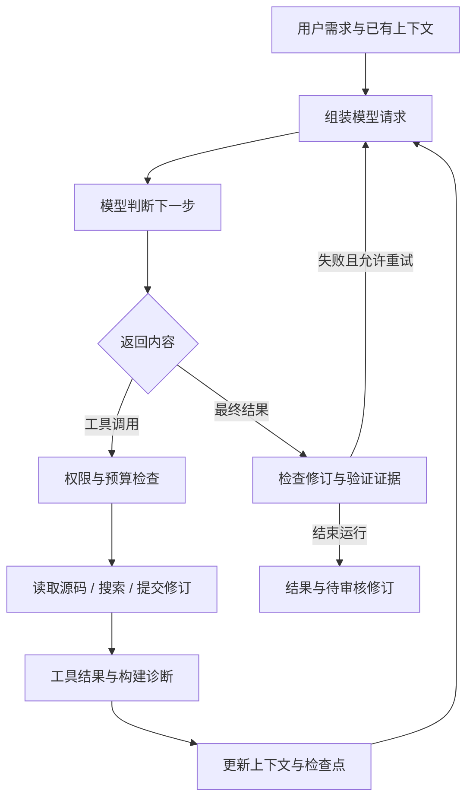

模型会随着证据更新方案。例如修复编译错误时，先读取报错位置及相关声明，再提交相关修改；运行时构建隔离草稿，模型依据新的诊断继续修复。它不要求在开始时就制定完整且不可变的执行计划。具体编排见 [工具循环实现](libai/runtime/coding_tool_loop.cpp)。

### 上下文与任务记忆

模型通过请求上下文和工具读取逐步了解项目，不会自动获得整个仓库。每轮请求结合用户需求、任务契约 `task_contract`、可用会话与工具历史、已读取源码、当前修订、验证能力及诊断结果。

任务契约持续保留用户要求，降低多轮执行时遗漏需求的风险；它不能保证模型已经正确理解每条要求。上下文过大时，运行时压缩历史，保留源码工作集、近期交互、修订状态与关键结果，并清理部分原生工具历史。被移除的代码可能需要重新读取。

检查点保存的是可恢复的任务状态与上下文，而不是模型永久记忆或可直接恢复的内部思维状态。详见 [请求组装](libai/runtime/coding_tool_loop_request.cpp) 和 [上下文压缩与检查点](libai/runtime/coding_tool_loop_feedback.cpp)。

### 思考强度与执行模式

| 配置 | 作用 | 边界 |
| --- | --- | --- |
| `thinking_enabled` | 请求启用或关闭模型思考，任务接口默认开启 | 只有模型和适配器支持时才会发送相应开关 |
| `reasoning_effort` | 任务接口接受 `low`、`high`、`max`，请求对应思考强度 | 实际参数与行为由 Provider 适配和模型能力决定 |
| `quick / standard / large` | 设置任务的工具调用、输出及部分上下文预算 | 不会因此自动更换模型，也不表示启用多智能体 |

界面或日志中的 reasoning 来自服务商返回的推理文本或摘要，不能据此观察模型完整的内部推理过程。更大的思考或执行预算也不保证更准确的结果。

如果模型耗尽输出预算却未给出答案或工具调用，适配层会按模型能力处理：对支持相应控制的模型可尝试关闭思考后恢复输出；对不支持关闭思考的特定模型，避免重复同样的自动请求，并保留可恢复状态。普通检查点恢复不会无条件降低用户指定的思考强度。详见 [任务参数处理](coolder/action/ai/ai_agent_actions.cpp) 和 [模型请求恢复](libai/provider/ai_provider_client.cpp)。

### 验证驱动修复与完成判断

运行时主动对保存后的修订进行构建检查，并把报告送回下一轮模型请求。模型返回最终结果时，还会检查当前修订的验证状态；最终文字中的“完成”本身不构成成功证据。

当前最终结果处理在满足预算和错误类型等条件时，允许编译失败最多额外进行 3 次最终验证修复，其他验证失败最多额外进行 1 次；这些次数只针对最终结果阶段，不是整个任务的总修改次数。验证环境不可用等情况会区别处理。

验收机制只从运行时验证报告提取可信证据，并核对报告对应的草稿与源码基线。配置测试通过不等于全部用户需求已得到覆盖，也不等于用户已经接受修订。详见 [最终结果与修复处理](libai/runtime/coding_tool_loop_response.cpp) 和 [任务验收证据](libai/runtime/coding_tool_loop_acceptance.cpp)。

### 防止重复探索与无效循环

- 新的有效观察或草稿变化被视为进展；重复且无效的调用会触发调整策略提示，达到无进展阈值后停止。
- 实现任务的探索达到检查点后，运行时收紧可用工具范围，要求进入实现阶段，并为缺失源码保留有限补充读取机会。当前阈值为 `max(1, min(24, 工具预算 / 2))`；只读分析和纯验证任务有相应例外。
- 连续 6 轮未执行工具且没有正常结束时，停止协议或策略重试，并尝试保存可恢复检查点。
- 总工具预算、输出限制、超时、暂停和取消共同约束任务执行。

这些机制减少反复读文件、只输出计划或持续无效修复的情况；预算过紧也可能使复杂任务过早结束。相关决策见 [进展监督器](libai/agent/agent_progress_supervisor.cpp)。

### 能力与局限

这种方式适合范围明确、能够通过构建或测试获得反馈的增量开发任务。效果同时取决于模型能力、上下文质量、工具可用性和验收覆盖率。需求理解仍主要依赖模型，上下文压缩可能丢失细节，提示词与规则需要持续维护，而架构合理性、交互体验及未转化为断言的业务要求仍需要人工判断。

以上描述基于当前源码实现，不代表已对不同模型的正确率、速度或成本完成对比评测。

## 功能组成

### 项目管理与规划

- 创建项目脚手架，或导入已有目录与 Git 仓库；支持工作区相对路径，以及经权限检查的本地绝对路径。
- 浏览项目文件，读取和搜索源码，刷新项目索引。
- 生成模块与任务计划，保存计划版本并更新任务状态。
- 围绕项目组织会话和历史运行，支持继续会话与导出会话。

项目语言配置涵盖 C、C++、JavaScript、Python、Java、Go、Rust、Objective-C、Swift、C#、Kotlin、PHP 和 D。语言可选不代表当前机器已具备对应的构建、运行或测试能力；实际执行取决于工具链安装、管理员策略、平台和沙盒支持，其中 Objective-C 项目限定为 macOS。

### 智能体运行与工具

- 提供快速、标准和大型任务模式，结合管理员策略设置输出、工具调用及上下文预算。
- 支持目录列表、单文件与批量读取、源码搜索、符号与代码大纲查询。
- 支持文件提案、批量修订、补丁集和精确文本替换。
- 展示运行状态、关键阶段、工具调用与验证记录，支持暂停、继续和取消任务。
- 保存运行记录和检查点，支持中断后的恢复及历史成果审核。

### 构建验证与自动修复

代码修订保存后，运行时可自动对隔离草稿执行构建检查。编译报告包含退出状态、输出和错误诊断，并反馈到后续模型请求中，使智能体优先修复构建错误。

在 macOS/Linux 上，项目根目录存在 `build.sh` 且具备获准工具链时，可在沙盒内执行该脚本；没有脚本时使用固定工具链命令。Windows 当前使用固定工具链构建。中间构建检查与最终验收分开记录，持续失败受调用预算、无进展控制和取消机制约束。

### 代码编辑与变更审核

- 内置 Monaco 编辑器，提供语法高亮、行号、折叠、查找、搜索替换、撤销与重做；补全能力随文件类型而定。
- 源码与差异支持多文件标签，保留各标签的编辑内容、撤销记录和滚动位置。
- 手动编辑先预览差异、确认后保存；AI 修改支持逐个接受或拒绝，也可批量写入。
- 保存与审核使用版本校验，检测并发修改；关闭未保存文件时会提示确认。
- 编辑器资源与语言 Worker 均从本机加载，无需 CDN；当前未接入外部 LSP。

### 界面语言与个人设置

在“个人设置”中选择中文、English、日本語或 한국어，并调整配色与字号。偏好按账户保存；应用界面保存后切换，Monaco 内置菜单语言在首次加载时确定，切换后刷新页面生效。语言设置不会翻译项目源码、用户输入和已有模型输出。

语言包通过 JSON 模板与清单扩展，详见 [界面国际化说明](coolder/html/i18n/README.md)。本页中英文部分分别使用对应语言的运行截图；截图记录演示时的界面，后续版本布局和选项可能有所变化。

### 会话与附件

会话支持粘贴、拖放或选择附件。PNG、JPEG、GIF、WebP 图片需要所选模型支持视觉输入；其他附件按 UTF-8 文本处理，适合源码、Markdown、JSON 和文本需求说明，不支持直接解析 PDF、Office 等二进制文档。

每次最多 8 个附件，单个不超过 8 MiB，总计不超过 16 MiB，文本上下文合计不超过 32 KiB。附件作为任务输入，不会自动写入项目。`Ctrl/Cmd+Enter` 提交任务，编辑器中的 `Ctrl/Cmd+S` 生成保存差异预览。

### 模型、账户与管理策略

管理员可以配置多个模型服务的协议、Base URL、模型 ID 和 API Key，启用模型并测试连接。API Key 由 libai 加密保存，列表接口不回传密钥。使用 Ollama 等本地服务时仍需配置相应端点和模型，Coolder 本身不内置模型权重或推理服务。

首次启动创建管理员，普通用户由管理员创建。管理员可启停账户、重置密码，并设置智能体总开关、角色权限、每用户并行任务数、语言工具、超时和资源限制。账户停用及策略变更会影响后续请求和新任务，已开始任务继续使用启动时的策略快照。

## 应用场景

| 场景 | 如何使用 Coolder | 适合审核的成果 |
| --- | --- | --- |
| 新项目原型 | 创建脚手架，描述模块、接口和验收要求，逐步生成实现 | 项目结构、代码、构建结果与待接受修订 |
| 现有项目功能开发 | 导入工作区内项目，让智能体理解相关代码后实现增量需求 | 多文件差异、接口改动和验证记录 |
| 编译错误与缺陷修复 | 提供复现步骤、错误日志和预期行为，结合工具诊断迭代修复 | 修复补丁及对应构建或测试证据 |
| 代码阅读与重构 | 围绕模块职责、调用关系或重复逻辑提问，再限定范围重构 | 代码说明、模块计划与可审核修改 |
| 测试与文档维护 | 指定需要覆盖的行为或说明范围，补充测试、注释和文档 | 测试代码、执行结果和文档差异 |
| 多账户本地开发环境 | 管理员统一提供模型与工具策略，各账户在独立工作区开展任务 | 按账户保存的项目、会话与运行记录 |
| 编程智能体二次开发 | 将 libai 链接到其他 C++ 宿主，复用模型、工具和运行时 | 自定义命令行、桌面或服务端集成 |

例如，可以提交：“阅读当前项目，给配置加载模块增加格式校验；保持现有接口兼容，补充错误输入测试，并说明修改和验证结果。”明确项目范围、兼容约束与验收要求，有助于获得更可检查的成果。

## 快速开始

### 1. 获取源码

ACL 以 Git 子模块保存在 `third-party/acl`，来源为 [acl-dev/acl](https://github.com/acl-dev/acl)，由主仓库锁定提交版本。

```sh
git clone --recurse-submodules https://github.com/fly-speed/coolder.git
cd coolder
```

已克隆仓库或切换版本后执行：

```sh
git submodule update --init --recursive
```

GitHub 下载的源码 ZIP 不包含子模块内容，请使用 Git 克隆。

### 2. 构建与启动

准备 CMake 3.16+、支持 C++17 的 C/C++ 编译工具链及 OpenSSL 开发库，在仓库根目录执行：

```sh
cmake -S coolder -B coolder/build -DCMAKE_BUILD_TYPE=Release -DBUILD_ACL=ON
cmake --build coolder/build --parallel 4
./coolder/build/coolder
```

`BUILD_ACL=ON` 从子模块源码编译 ACL，无需预先生成 ACL 库。非标准位置的 OpenSSL 可通过 `-DOPENSSL_ROOT_DIR=/path/to/openssl` 指定。

浏览器访问 **[http://127.0.0.1:18095](http://127.0.0.1:18095)**。

也可以使用仓库自带的 OpenSSL 和 zlib，统一编译依赖：

```sh
make -C third-party
cmake -S coolder -B coolder/build -DCMAKE_BUILD_TYPE=Release -DBUILD_ACL=OFF
cmake --build coolder/build --parallel 4
```

Windows 原生 VS 2022 工程位于 `coolder/coolder.sln`，依赖 `third-party/acl` 和 `third-party/zlib-1.2.11`。OpenSSL 可通过 `third-party/build-openssl.bat` 构建 x64 Release 版本。平台依赖与详细步骤见 [第三方依赖说明](third-party/README.md) 和 [应用说明](coolder/README.md)。

### 3. 完成首次配置

1. 在初始化页面创建管理员账户。
2. 打开“管理控制台 → 大模型厂商”，配置协议、端点、模型和 API Key。
3. 勾选“启用此模型”和“允许向此模型发送项目代码”，保存并测试连接。
4. 在“智能体设置”中检查可用工具链、权限、任务额度和超时。
5. 创建项目，或导入工作区内及已授权本地目录中的已有项目。
6. 提交任务，查看进展与验证结果，在“变更”中审核并接受修改。

### 4. 指定数据与工作区目录

```sh
./coolder/build/coolder \
  --port 18095 \
  --data /absolute/coolder-data \
  --workspace /absolute/authorized-projects
```

| 参数 | 用途 | 默认行为 |
| --- | --- | --- |
| `--port` | 本地 HTTP 端口 | `18095` |
| `--data` | 账户、配置及运行状态存储目录 | 启动时当前目录下的 `var/` |
| `--workspace` | 管理员授权的项目工作区 | 数据目录下的 `workspace/` |
| `--html` | 前端静态资源目录 | 使用程序发现的前端资源；独立安装时可显式指定 |

普通用户的默认工作区位于数据目录下的 `users/<账户 ID>/workspace/`。项目位置可按以下方式指定：

| 方式 | 示例与行为 |
| --- | --- |
| 工作区相对路径 | 工作区为 `/work`、项目为 `/work/myapp` 时填写 `myapp` |
| 本地绝对路径 | 填写 `/absolute/projects/myapp`，可位于默认工作区外 |
| 选择目录 | 浏览运行 Coolder 的电脑上的目录并回填路径；新项目可选择空目录，或在父目录后追加新目录名 |

管理员可以使用外部项目目录，普通用户需要管理员启用本地目录项目权限。外部目录中的代码仍由操作系统文件权限约束，不会因为导入自动获得独立副本。自定义管理员工作区须遵循数据与账户目录的隔离要求。

### 5. 安装与停止服务

在仓库根目录执行：

```sh
cmake --install coolder/build --prefix /absolute/coolder-install
/absolute/coolder-install/bin/coolder \
  --data /absolute/coolder-data \
  --html /absolute/coolder-install/share/coolder/html
```

安装会将主程序与 `webcool-sandbox-helper` 放入同一 `bin/` 目录，并部署前端资源。运行目标项目所需的语言工具链仍需单独安装。用 `Ctrl+C` 停止前台服务；POSIX 平台也支持 `SIGTERM`。运行多个实例时使用不同端口和数据目录。

Linux 上若使用启用了 io_uring 的 ACL 静态库，还需要对应的 liburing 开发库。可通过 `-DHAS_IO_URING=ON` 要求 CMake 检查依赖，或用 `-DAI_URING_LIBRARY=/absolute/path/to/liburing.a` 指定库。更多构建与代码规范说明见 [BUILD.md](BUILD.md)。

## 任务实践

一次任务尽量聚焦一个可验证目标，说明需要保持的接口、允许修改的范围和验收条件。例如：

```text
目标：给命令行程序增加可选的姓名参数。
范围：修改参数解析、帮助信息和相关测试，保持无参数调用兼容。
约束：不引入新的运行时依赖，不修改无关模块。
验收：无参数时使用默认名称；空名称或多余参数返回非零退出码。
交付：生成待审核修订，说明修改内容、执行的检查和未验证项。
```

阅读项目时可明确要求“只分析、不修改文件”；修复问题时提供复现步骤、实际结果、预期结果及日志。任务规模较大时先使用项目计划拆分模块，再逐项实现和验收。

| 看到的结果 | 下一步 |
| --- | --- |
| 生成完成，但仍有待审核修订 | 查看差异后接受修改，才会写入正式项目 |
| 构建通过 | 继续检查测试和具体需求；编译成功不能证明交互或业务行为正确 |
| 验证未执行或环境不可用 | 检查工具链与策略，补齐环境后再验证 |
| 文件版本冲突 | 对照当前源码重新审核，避免覆盖任务期间的外部编辑 |
| 预算耗尽或任务中断 | 查看已保存成果与具体错误，有恢复入口时继续，必要时缩小任务范围 |

## 常见问题

| 问题 | 检查与处理 |
| --- | --- |
| 启动后页面打不开 | 查看进程是否仍在运行及启动日志；使用实际端口的 `http://127.0.0.1:端口`，不要替换为局域网地址 |
| 提示找不到前端资源 | 显式传入 `--html`，指向构建源码的 `coolder/html` 或安装后的 `share/coolder/html` |
| 模型列表为空或不能发送代码 | 由管理员配置并启用模型，同时允许发送项目代码；普通用户不能自行管理厂商配置 |
| 外部目录不能创建或导入 | 检查绝对路径是否属于运行 Coolder 的电脑，以及本地目录项目权限和操作系统访问权限 |
| 能生成源码但无法构建 | 确认相应工具链已安装、策略允许执行，并查看验证报告；必要时检查 helper 是否与主程序同目录 |
| 修改前端脚本后页面没有变化 | 重新运行 `cmake --build coolder/build` 生成合并脚本，再刷新页面；不要直接修改 `coolder.js` |
| 切换语言后编辑器菜单仍是原语言 | 刷新页面以重新加载 Monaco；未保存编辑请先完成保存 |

## 数据、权限与当前边界

- **本地访问**：服务固定绑定 `127.0.0.1`，校验对应端口的 Host/Origin，目前不提供其他电脑直接访问的部署入口。多账户可通过不同浏览器或浏览器配置文件使用。
- **用户隔离**：账户拥有独立工作区；管理员管理账户和全局策略，但不会自动获得普通用户项目的浏览入口。
- **登录与密钥**：登录使用 HttpOnly、SameSite=Strict Cookie；密码采用加盐 PBKDF2-HMAC-SHA256 保存；模型密钥加密存储。
- **执行边界**：文件操作受授权目录约束，构建和运行复用 libai 沙盒能力；不开放任意 shell API。可执行语言与验证效果取决于本机环境。
- **持久化与恢复**：服务重启后保留账户、策略、模型配置、项目、会话和运行记录，浏览器需要重新登录；检查点恢复不意味着所有中断任务都能无条件续跑，历史工具输出也受保留期限制。
- **能力范围**：当前应用支持受权限控制的本地项目目录；共享目录、邮件、文件备份和浏览器调试扩展尚未接入。libai 内部能力不等同于 Coolder 已开放的功能。
- **备份范围**：应备份整个数据目录、所有账户使用的外部项目目录以及 libai 加密密钥文件；重要项目建议保留 Git 提交。

仓库包含 macOS/Linux 构建配置、Windows VS 工程及本地模拟模型测试。应用文档记录了 macOS 编译与部分浏览器验收，但没有覆盖所有平台、工具链和外部模型组合的统一验收报告。部署时应在目标环境运行验证；构建配置或协议适配本身不代表测试通过。

## 仓库结构与二次开发

```text
coolder/
├── README.md                 # 项目总览与入门
├── LICENSE                   # MIT 许可证
├── coolder/                  # 浏览器编程应用
│   ├── main.cpp              # 服务入口
│   ├── server/               # 身份认证、策略与 HTTP 宿主
│   ├── action/ai/            # AI 业务路由实现
│   ├── html/                 # 工作台、编辑器与本地静态资源
│   ├── sandbox/              # 沙盒辅助进程入口
│   ├── tests/                # HTTP、账户与前端回归测试
│   └── tools/                # 前端脚本合并工具
├── libai/                    # 可独立复用的 AI 编程静态库
│   ├── agent/、runtime/      # 智能体协议、调度与执行循环
│   ├── provider/、context/   # 模型接入与上下文管理
│   ├── project/、workspace/  # 项目、工具与变更管理
│   ├── sandbox/、validation/ # 执行隔离与验证
│   ├── storage/、prompt/     # 持久化与提示词
│   └── docs/、examples/      # 设计说明与独立链接示例
└── third-party/              # ACL、OpenSSL、zlib 与构建脚本
```

libai 公开聚合头文件为 `<libai/coding.h>`，推荐链接 CMake 目标 `libai::ai`，可独立构建、安装并集成到其他程序。宿主负责 ACL/fiber 初始化、线程生命周期、鉴权及工作目录授权，执行工具还需部署沙盒辅助进程。

库保留 `webcool::ai` 等命名空间、内部 `.webcool_*` 存储格式，以及 `webcool-sandbox-helper` 辅助程序名作为兼容约定；Coolder 可以独立构建和运行，无需构建 webcool 应用。

前端源脚本由 CMake 自动合并为 `coolder/html/coolder.js`，请修改原始脚本，不要直接编辑生成文件。详细集成方式见 [libai 文档](libai/README.md)。

## 开发验证与文档

完成构建后，可从仓库根目录运行已注册的 HTTP 与账户集成测试；配置时需要能够找到 Python 3：

```sh
ctest --test-dir coolder/build --output-on-failure
```

前端回归测试需要 Node.js，例如：

```sh
node coolder/tests/chat_display_test.js
node coolder/tests/source_tabs_test.js
node coolder/tests/diff_views_test.js
node coolder/tests/run_progress_test.js
```

这些 HTTP 集成测试使用临时目录与本地模拟模型，不需要真实 API Key。测试命令及覆盖范围说明不代表当前检出版本已在所有平台完成验证。

- [构建与贡献规范](BUILD.md)：依赖构建、C++ 格式、函数与文件规模、接口注释检查。
- [应用使用与部署说明](coolder/README.md)：账户、API、编辑器、附件、Windows 构建和安装细节。
- [libai 独立库说明](libai/README.md)：模块边界、SDK 构建、安装与集成。
- [libai 设计文档索引](libai/docs/README.md)：运行时、工作区、验证及重构记录；部分文档保留原宿主路径，应结合当前仓库结构阅读。
- [自动构建与修复机制](libai/docs/AUTOMATIC_BUILD_REPAIR.md)：草稿构建、诊断反馈与修复循环。
- [第三方依赖说明](third-party/README.md)：依赖来源、平台构建与许可信息。

## 许可证

Coolder 使用 [MIT License](LICENSE)。ACL、OpenSSL、zlib 和 Monaco Editor 等第三方组件遵循各自的许可证。

---

<a id="english"></a>

[English](#english) | [中文](#chinese)

# Coolder

**Coolder is a locally deployed AI coding agent that you use through a browser.** It brings language models, project context, code tools, build verification, and change review into one workspace. Describe a task in natural language to explore code, implement features, fix problems, and maintain real projects.

Coolder reads and searches source files, proposes changes across multiple files, and attempts builds and repairs in an isolated draft. You review the changes before applying them to the project. The application uses **C++17, an ACL coroutine HTTP server, and a native web frontend**, with its core coding capabilities provided by **libai**, a reusable static library.

**On this page:** [Screenshots](#screenshots) · [Architecture](#architecture) · [Reasoning](#agent-reasoning-mechanism) · [Capabilities](#capabilities) · [Quick start](#quick-start) · [Task workflow](#task-workflow) · [Troubleshooting](#troubleshooting) · [Development](#development-checks-and-documentation)

## Key Features

- **Work with real projects**: Create a project scaffold or import existing directories and Git repositories from a workspace or an authorized local path. Use project indexes, plans, and sessions to continue development.
- **Models working with tools**: The agent reads files, searches code, inspects outlines, proposes patches, and invokes validation tools, then uses their results to guide subsequent steps.
- **Build feedback and repair**: Incremental revisions are checked in an isolated draft. Compiler diagnostics feed back into the model to support an edit–validate–repair loop.
- **Reviewable changes**: AI revisions are staged for diff review. Accept or reject individual changes, or accept and apply all pending changes together.
- **Multiple model protocols**: Supports OpenAI compatible, OpenAI Chat, OpenAI Responses, Anthropic, Gemini, and Ollama protocols.
- **Accounts and policies**: Administrators manage models, users, language tools, concurrency quotas, and execution limits. Each account has its own workspace.
- **Browser workspace**: Includes Monaco, project browsing, conversations, task progress, and diff review. The frontend builds without npm, and editor assets are served locally.

## Screenshots

These screenshots show a separate Coolder demo instance running on macOS, using the English interface, a demo account, and the `hello-coolder` project. The task prompt has not been submitted to a model; the code edits and diff demonstrate manual editing.

### Project Workspace

Manage projects and sessions on the left, enter coding tasks in the center, and browse project files or switch to changes and tool records on the right.

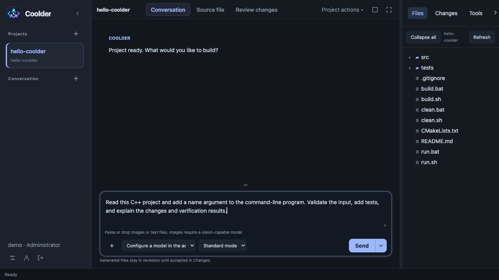

### Code Editor

Edit C++ source directly in the workspace with syntax highlighting, file tabs, search and replace, and diff previews.

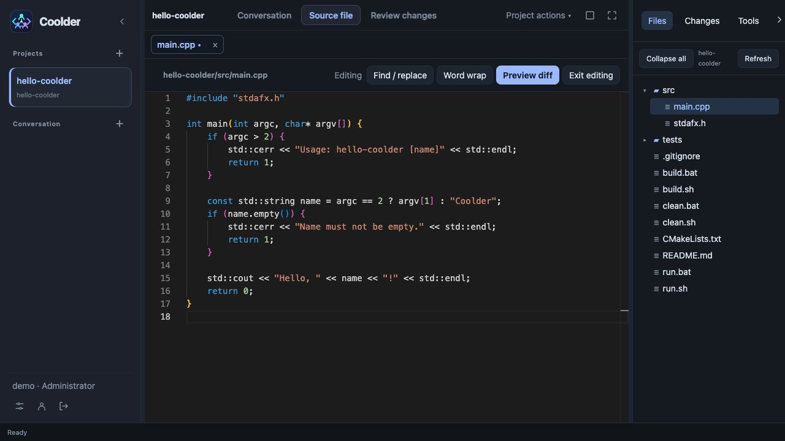

### Diff Review

Inspect added and removed lines before returning to the editor or confirming a save. This screenshot illustrates the manual edit review workflow.

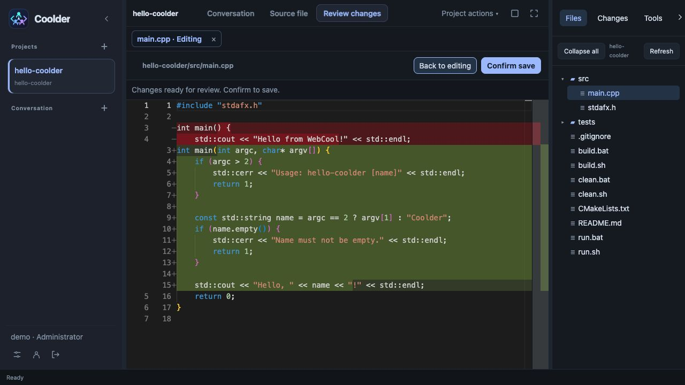

### Administration Console

Administrators manage users, agent policies, and model providers in one console. This view shows agent availability and role permissions.

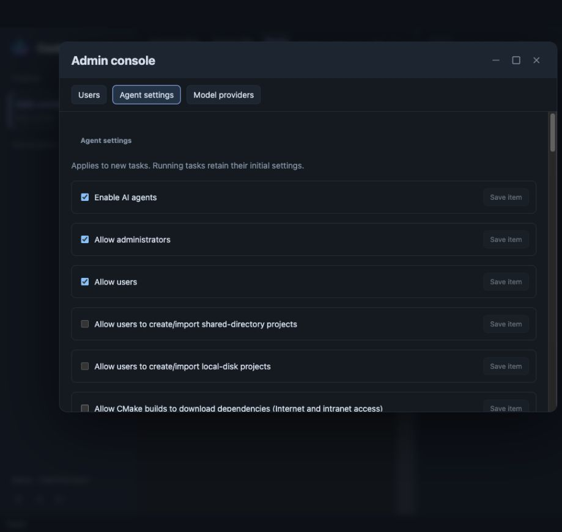

## Architecture

### Layers

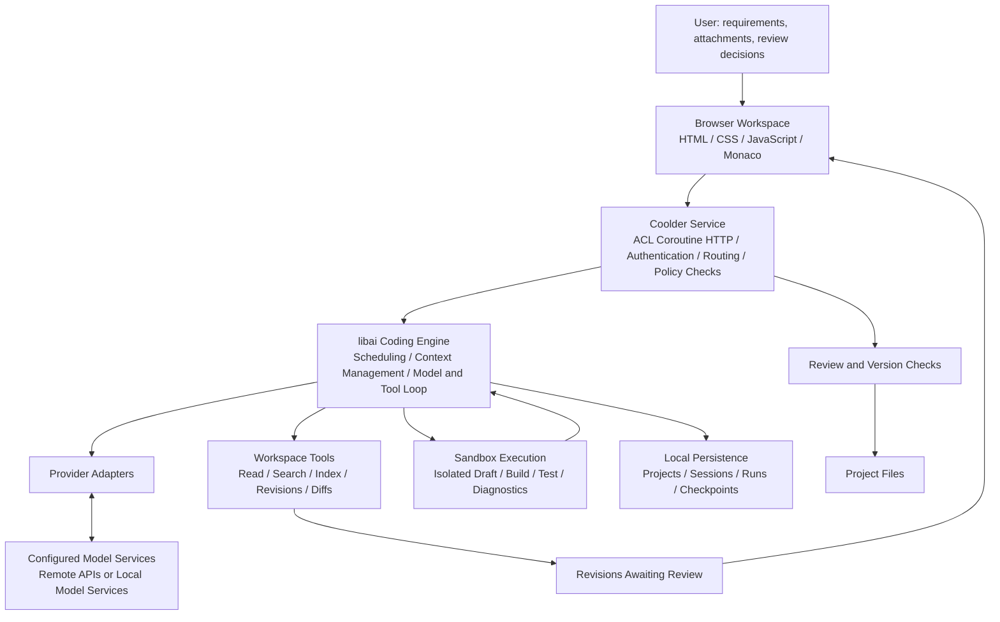

| Layer | Main components | Responsibilities |
| --- | --- | --- |
| Browser workspace | `coolder/html/` | Projects and conversations, file editing, task status, diff review, personal settings, and administration |
| Application host | `coolder/main.cpp`, `coolder/server/` | Startup, authentication, workspace assignment, Host/Origin validation, role permissions, and HTTP dispatch |
| Application APIs | `coolder/action/ai/` | Exposes model configuration, projects, sessions, tasks, files, and reviews through `/api/v1/ai/` |
| Agent engine | `libai/agent/`, `libai/runtime/` | Execution modes, scheduling, model and tool loops, pause, cancellation, recovery, and background execution |
| Models and context | `libai/provider/`, `libai/context/`, `libai/prompt/` | Protocol adapters, streaming responses, context assembly and compaction, read coverage, and prompts |
| Projects and workspaces | `libai/project/`, `libai/workspace/` | Metadata, scaffolding, indexing, planning, constrained file operations, patches, diffs, and review state |
| Execution and validation | `libai/sandbox/`, `libai/validation/` | Sandbox boundaries, build and test evidence, proposal validation, and repair convergence |
| State storage | `libai/storage/` | Local persistence for sessions, runs, checkpoints, drafts, results, and workflows |

### Design Principles

**Separate the host from the engine.** Coolder handles the browser UI, HTTP, accounts, and project directory authorization. libai handles models, tools, workspaces, and the task runtime. After authentication, the host explicitly supplies user directories, model configuration, and execution policies. The library does not depend on Coolder's HTTP implementation and can be linked into other C++ applications.

**Use execution feedback to advance tasks.** Model-generated tool calls execute after permission and quota checks. File contents, compiler diagnostics, and validation reports become context for subsequent requests. Context compaction, tool budgets, and limits on calls without progress constrain the execution loop.

**Separate generation from application.** AI edits become persistent revisions and are validated in an isolated draft. When you accept changes, the server checks file versions and hashes to avoid overwriting external edits made during the task.

**Keep state locally and use models as configured.** Projects, accounts, and run state are stored on the local machine. When using a remote model, the code and context needed for the task are sent to that service. An administrator must explicitly enable the model and allow project code to be sent to it.

### Task Lifecycle

1. **Create a task**: Select a project, session, model, and execution mode, then submit requirements and optional attachments.
2. **Prepare context**: The runtime assembles model input from project information, conversation history, checkpoints, and tool results.
3. **Call tools**: The model reads directories and source files, searches symbols, inspects code outlines, proposes edits, or requests validation as needed.
4. **Stage revisions**: New and modified content is saved as staged revisions and materialized in an isolated draft for subsequent tools.
5. **Validate and repair**: When the required toolchain and sandbox capabilities are available, the runtime checks builds and returns failures to the model for repair. Full acceptance checks depend on the task and available validators.
6. **Review and apply**: Inspect the results and diffs, accept or reject individual changes, or accept and apply all pending changes.
7. **Continue iterating**: Sessions and run records remain available for follow-up tasks. The runtime can use checkpoints after an interruption; recovery is triggered by status queries.

“Generation complete” may still mean revisions are awaiting review and have not been written to the project. A successful build does not establish that all tests passed or all requirements were met; consult the validation reports and verify the resulting behavior.

## Agent Reasoning Mechanism

Coolder uses a **ReAct-style model and tool loop combined with build validation and automatic repair**. The model selects the next action from the available evidence, while the runtime executes actions, returns observations, and constrains the task. This describes the implementation pattern; it does not imply a dependency on a framework named ReAct.

### Model Decisions and Runtime Control

| Layer | Responsibilities |
| --- | --- |
| Model reasoning | Interpret requirements, analyze source code, form an implementation approach, select tools, and revise the approach using execution results |
| Runtime control | Assemble context, check permissions and budgets, execute tools, maintain isolated drafts, trigger validation, detect lack of progress, and save checkpoints |
| User review | Inspect results and diffs and decide which revisions to apply to the project |

The main execution path makes successive decisions using the model selected for a task. It does not orchestrate separate planning, implementation, and review models or search a tree of candidate solutions. Some read tools execute in parallel, but parallel tools do not imply multiple reasoning agents.

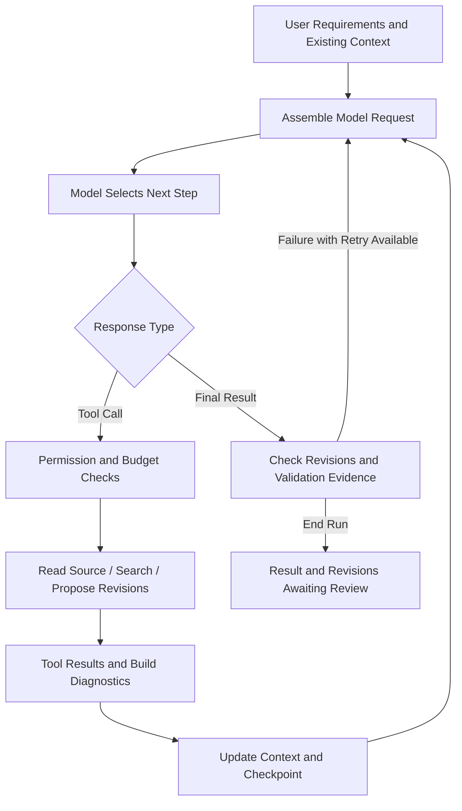

The model adjusts its approach as evidence arrives. For a compiler error, it can read the failing source and related declarations, propose coordinated edits, and use diagnostics from the runtime's isolated draft build to guide another repair. It does not require a complete, immutable plan before execution begins. See the [tool loop implementation](libai/runtime/coding_tool_loop.cpp).

### Context and Task Memory

The model learns about a project through request context and tool reads; it does not automatically receive the entire repository. Each request combines user requirements, the `task_contract`, available conversation and tool history, retained source, current revisions, validation capabilities, and diagnostics.

The task contract preserves user requests across turns to reduce omissions, but it does not establish that the model has interpreted every requirement correctly. When context grows too large, the runtime compacts history, retains a source working set, recent exchanges, revision state, and key results, and clears some native tool history. Evicted source may need to be read again.

Checkpoints preserve recoverable task state and context, rather than permanent model memory or a directly resumable internal thought state. See [request assembly](libai/runtime/coding_tool_loop_request.cpp) and [context compaction and checkpoints](libai/runtime/coding_tool_loop_feedback.cpp).

### Thinking Effort and Execution Modes

| Setting | Purpose | Boundary |
| --- | --- | --- |
| `thinking_enabled` | Requests model thinking on or off; enabled by default in the task API | A corresponding toggle is sent only when supported by the model and adapter |
| `reasoning_effort` | The task API accepts `low`, `high`, and `max` to request an effort level | Effective parameters and behavior depend on provider adaptation and model capabilities |
| `quick / standard / large` | Controls tool-call, output, and some context budgets for a task | Does not automatically change models or enable multiple agents |

Reasoning shown in the interface or logs is text or a summary returned by the provider; it does not expose the model's complete internal reasoning process. Larger thinking or execution budgets do not guarantee more accurate results.

If a model exhausts its output budget without producing an answer or tool call, recovery depends on its capabilities. Supported models may retry with thinking disabled; certain models without a thinking-off control avoid an identical automatic retry and retain recoverable state. Ordinary checkpoint recovery does not unconditionally lower the user's requested effort. See [task parameter handling](coolder/action/ai/ai_agent_actions.cpp) and [model request recovery](libai/provider/ai_provider_client.cpp).

### Validation-Driven Repair and Completion

The runtime proactively checks builds after revisions are saved and feeds reports into subsequent model requests. When the model returns a final result, the runtime also checks validation for the current revision. A textual claim of completion is not itself evidence of success.

Under the applicable budget and error conditions, final-result handling currently permits up to 3 additional final-validation repair attempts for compiler failures and 1 for other validation failures. These limits apply to the final-result stage, not to the total number of edits in a task. Unavailable validation environments and other special cases are handled separately.

Acceptance uses trusted runtime validation reports and checks their draft and source baseline against the current state. Passing configured tests does not establish coverage of every user requirement or mean that the user has accepted the revisions. See [final-result and repair handling](libai/runtime/coding_tool_loop_response.cpp) and [task acceptance evidence](libai/runtime/coding_tool_loop_acceptance.cpp).

### Repeated Investigation and Loop Limits

- New successful observations or draft changes count as progress. Repeated unproductive calls trigger guidance to change approach, and the run stops at the no-progress threshold.
- At an investigation checkpoint, implementation tasks receive a narrower tool set and guidance to implement, with a limited allowance for missing source reads. The current threshold is `max(1, min(24, tool budget / 2))`; read-only analysis and verification-only tasks have corresponding exceptions.
- After 6 consecutive turns without tool execution or normal completion, protocol or policy retries stop and the runtime attempts to save a recoverable checkpoint.
- Total tool budgets, output limits, timeouts, pause, and cancellation also constrain execution.

These controls reduce repeated reads, plan-only responses, and unproductive repairs. Tight budgets can also end complex tasks too early. See the [progress supervisor](libai/agent/agent_progress_supervisor.cpp).

### Strengths and Limitations

This approach fits incremental development with clear scope and actionable build or test feedback. Results depend on model capabilities, context quality, available tools, and acceptance coverage. Requirement interpretation still relies mainly on the model, context compaction can lose details, prompts and rules need ongoing maintenance, and architectural quality, user experience, and business requirements without executable assertions still require human judgment.

This description reflects the current source implementation; it is not a comparative evaluation of model accuracy, speed, or cost.

## Capabilities

### Project Management and Planning

- Create project scaffolds or import existing directories and Git repositories using workspace-relative paths or local absolute paths subject to permission checks.
- Browse project files, read and search source code, and refresh the project index.
- Generate module and task plans, save plan versions, and update task status.
- Organize sessions and historical runs by project, continue conversations, and export sessions.

Project language options include C, C++, JavaScript, Python, Java, Go, Rust, Objective-C, Swift, C#, Kotlin, PHP, and D. Selecting a language does not mean that its build, runtime, or test tools are installed. Execution depends on the toolchain, administrator policy, platform, and sandbox support. Objective-C projects are limited to macOS.

### Agent Runtime and Tools

- Quick, standard, and large task modes use output, tool-call, and context budgets governed by administrator policy.
- Tools support directory listing, single-file and batch reads, source search, symbol queries, and code outlines.
- Editing tools support file proposals, batch revisions, patch sets, and exact text replacement.
- Run status, key stages, tool calls, and validation records are visible. Tasks can be paused, continued, or cancelled.
- Run records and checkpoints support recovery after interruptions and review of previously generated results.

### Build Validation and Automatic Repair

After revisions are saved, the runtime can automatically check a build in the isolated draft. Reports include exit status, output, and diagnostics. These reports feed into subsequent model requests so the agent can prioritize build errors.

On macOS/Linux, a project-root `build.sh` can run in the sandbox when an authorized toolchain is available; without that script, fixed toolchain commands are used. Windows currently uses fixed toolchain commands. Intermediate build checks are recorded separately from final acceptance checks. Tool budgets, limits on calls without progress, and cancellation constrain repeated failures.

### Code Editing and Change Review

- Monaco provides syntax highlighting, line numbers, folding, search, search and replace, undo, and redo. Completion capabilities depend on the file type.
- Source and diff views support multiple file tabs. Source tabs preserve their edit buffers, undo history, and scroll positions.
- Manual edits require a diff preview and confirmation before saving. AI changes can be accepted or rejected individually, or applied together.
- Saving and review check file versions to detect concurrent changes. Closing a file with unsaved edits prompts for confirmation.
- Editor resources and language workers are served locally without a CDN. External LSP integration is not currently provided.

### Interface Language and Personal Settings

Open Personal settings to select 中文, English, 日本語, or 한국어 and adjust colors and font size. Preferences are saved per account. Application labels change after saving; Monaco's built-in menu language is selected when the editor first loads, so refresh the page after switching languages. Language settings do not translate source files, user input, or existing model output.

Language packs can be extended using JSON templates and a manifest; see the [internationalization guide](coolder/html/i18n/README.md). The Chinese and English sections of this page use screenshots in their respective languages. Screenshots show the demo interface at capture time; layouts and options may change in later versions.

### Conversations and Attachments

Paste, drag and drop, or select attachments in a conversation. PNG, JPEG, GIF, and WebP images require a model that supports visual input. Other attachments are interpreted as UTF-8 text, suitable for source code, Markdown, JSON, and written requirements. Binary documents such as PDF and Office files are not directly parsed.

Each submission supports up to 8 attachments, with an 8 MiB per-file limit, a 16 MiB total limit, and up to 32 KiB of combined text context. Attachments are task inputs and are not automatically written into the project. Use `Ctrl/Cmd+Enter` to submit a task and `Ctrl/Cmd+S` in the editor to preview the save diff.

### Models, Accounts, and Policies

Administrators configure the protocol, Base URL, model ID, and API key for multiple model services, enable models, and test connections. libai encrypts stored API keys, and list endpoints do not return them. Local services such as Ollama still require a configured endpoint and model; Coolder does not bundle model weights or an inference server.

The first launch creates an administrator account. Administrators create regular users, enable or disable accounts, reset passwords, and configure agent availability, role permissions, concurrent tasks per user, language tools, timeouts, and resource limits. Account disabling and policy changes affect subsequent requests and new tasks. Existing tasks continue with the policy snapshot captured at startup.

## Use Cases

| Scenario | How to use Coolder | Results to review |
| --- | --- | --- |
| New project prototypes | Create a scaffold, describe modules, interfaces, and acceptance criteria, then implement incrementally | Project structure, code, build results, and staged revisions |
| Features in existing projects | Import a workspace project and ask the agent to understand related code before implementing a feature | Changes across files, interface updates, and validation records |
| Build errors and bug fixes | Provide reproduction steps, logs, and expected behavior, then iterate using tool diagnostics | Repair patches and corresponding build or test evidence |
| Code exploration and refactoring | Ask about responsibilities, call relationships, or duplicate logic, then define a bounded refactoring task | Explanations, module plans, and reviewable edits |
| Tests and documentation | Specify behaviors to cover or topics to explain, then add tests, comments, and documentation | Test code, execution results, and documentation diffs |
| Local development with multiple accounts | Centrally configure models and tool policies while each account works in its own workspace | Projects, sessions, and run records stored per account |
| Custom coding agents | Link libai into another C++ host to reuse models, tools, and the runtime | Custom CLI, desktop, or server integrations |

For example: “Read this project and add format validation to its configuration loader. Preserve the existing interface, add tests for invalid input, and explain the changes and validation results.” Explicit scope, compatibility constraints, and acceptance criteria make results easier to assess.

## Quick Start

### 1. Get the Source

ACL is stored as a Git submodule at `third-party/acl`, sourced from [acl-dev/acl](https://github.com/acl-dev/acl). The main repository pins its commit.

```sh
git clone --recurse-submodules https://github.com/fly-speed/coolder.git
cd coolder
```

For an existing checkout, or after switching versions:

```sh
git submodule update --init --recursive
```

GitHub source ZIP downloads do not include submodule contents. Use Git to clone the repository.

### 2. Build and Run

Install CMake 3.16+, a C/C++ toolchain supporting C++17, and OpenSSL development libraries. Run these commands from the repository root:

```sh
cmake -S coolder -B coolder/build -DCMAKE_BUILD_TYPE=Release -DBUILD_ACL=ON
cmake --build coolder/build --parallel 4
./coolder/build/coolder
```

`BUILD_ACL=ON` builds ACL from the submodule, so prebuilt ACL libraries are not required. For OpenSSL in a nonstandard location, pass `-DOPENSSL_ROOT_DIR=/path/to/openssl`.

Open **[http://127.0.0.1:18095](http://127.0.0.1:18095)** in your browser.

Alternatively, build the dependencies using the OpenSSL and zlib sources supplied with the repository:

```sh
make -C third-party
cmake -S coolder -B coolder/build -DCMAKE_BUILD_TYPE=Release -DBUILD_ACL=OFF
cmake --build coolder/build --parallel 4
```

The native Visual Studio 2022 solution is `coolder/coolder.sln`, with dependencies on `third-party/acl` and `third-party/zlib-1.2.11`. Use `third-party/build-openssl.bat` to build OpenSSL for x64 Release. See the [dependency guide](third-party/README.md) and [application guide](coolder/README.md) for platform requirements and detailed instructions.

### 3. Configure the Application

1. Create an administrator account on the initialization page.
2. Open the model provider settings in the administration console and configure the protocol, endpoint, model, and API key.
3. Enable the model and allow project code to be sent to it, then save and test the connection.
4. Review available toolchains, permissions, task quotas, and timeouts in the agent settings.
5. Create a project or import an existing project from the workspace or an authorized local directory.
6. Submit a task, inspect progress and validation results, then review and accept revisions in the changes view.

### 4. Set Data and Workspace Directories

```sh
./coolder/build/coolder \
  --port 18095 \
  --data /absolute/coolder-data \
  --workspace /absolute/authorized-projects
```

| Option | Purpose | Default behavior |
| --- | --- | --- |
| `--port` | Local HTTP port | `18095` |
| `--data` | Storage for accounts, configuration, and run state | `var/` under the working directory at startup |
| `--workspace` | Authorized project workspace for the administrator | `workspace/` under the data directory |
| `--html` | Frontend static assets | Uses discovered frontend assets; can be set explicitly for a standalone installation |

Regular users have default workspaces under `users/<account ID>/workspace/` in the data directory. Project locations support these options:

| Method | Example and behavior |
| --- | --- |
| Workspace-relative path | For workspace `/work` and project `/work/myapp`, enter `myapp` |
| Local absolute path | Enter `/absolute/projects/myapp`, which may be outside the default workspace |
| Directory picker | Browse directories on the computer running Coolder and populate the path; for a new project, choose an empty directory or append a new directory name to a parent path |

Administrators can use external project directories. Regular users need the administrator to enable local-directory project access. Operating-system file permissions still apply, and importing an external directory does not create an isolated copy of its source files. Custom administrator workspaces must satisfy data and account directory isolation requirements.

### 5. Install and Stop the Service

Run from the repository root:

```sh
cmake --install coolder/build --prefix /absolute/coolder-install
/absolute/coolder-install/bin/coolder \
  --data /absolute/coolder-data \
  --html /absolute/coolder-install/share/coolder/html
```

Installation places the executable and `webcool-sandbox-helper` in the same `bin/` directory and deploys frontend assets. Language toolchains for target projects must still be installed separately. Use `Ctrl+C` to stop the foreground service; POSIX platforms also support `SIGTERM`. Use separate ports and data directories for multiple instances.

On Linux, an ACL static library built with io_uring requires the corresponding liburing development library. Use `-DHAS_IO_URING=ON` to require a CMake dependency check, or `-DAI_URING_LIBRARY=/absolute/path/to/liburing.a` to specify a library. See [BUILD.md](BUILD.md) for further build instructions and code conventions.

## Task Workflow

Keep each task focused on a verifiable goal. Specify interfaces to preserve, the allowed scope, and acceptance criteria. For example:

```text
Goal: Add an optional name argument to the command-line program.
Scope: Update argument parsing, help text, and related tests; preserve no-argument usage.
Constraints: Add no runtime dependencies and leave unrelated modules unchanged.
Acceptance: Use a default name without arguments; return a nonzero exit code for an empty name or extra arguments.
Delivery: Produce revisions for review and explain changes, executed checks, and unverified items.
```

For code exploration, explicitly request analysis without file changes. For a defect, provide reproduction steps, actual and expected behavior, and logs. For larger tasks, use project planning to split modules before implementing and verifying them individually.

| Observed result | Next step |
| --- | --- |
| Generation finished with pending revisions | Inspect diffs and accept changes before they are written to the project |
| Build passed | Check tests and specific requirements; compilation does not establish correct interaction or business behavior |
| Validation did not run or the environment is unavailable | Check toolchains and policy, prepare the environment, and validate again |
| File version conflict | Review against current source to avoid overwriting external edits made during the task |
| Budget exhausted or task interrupted | Inspect saved work and the specific error, resume when available, or narrow the task scope |

## Troubleshooting

| Problem | What to check |
| --- | --- |
| The page will not open after startup | Check the process and startup log; use `http://127.0.0.1:port` with the actual port rather than a LAN address |
| Frontend assets cannot be found | Set `--html` to the source tree's `coolder/html` or the installed `share/coolder/html` directory |
| No models are listed or code cannot be sent | An administrator must configure and enable a model and permit project code transmission; regular users cannot manage provider settings |
| An external directory cannot be created or imported | Check that the absolute path is on the computer running Coolder, local-directory project access is allowed, and OS permissions permit access |
| Code generation works but builds do not | Check the installed toolchain, execution policy, and validation report; verify that the helper is alongside the executable when needed |
| Frontend source edits are not visible | Run `cmake --build coolder/build` to regenerate the bundled script and refresh the page; do not edit `coolder.js` directly |
| Editor menus remain in the previous language | Refresh the page to reload Monaco; save pending edits first |

## Data, Permissions, and Current Limitations

- **Local access**: The service binds to `127.0.0.1` and validates Host/Origin for the configured port. Direct access from other computers is not currently provided. Different browsers or browser profiles can be used for multiple accounts.
- **User isolation**: Accounts have separate workspaces. Administrators manage accounts and global policies but do not automatically receive an interface for browsing regular users' projects.
- **Authentication and secrets**: Login uses HttpOnly, SameSite=Strict cookies. Passwords use salted PBKDF2-HMAC-SHA256, and model API keys are encrypted at rest.
- **Execution boundaries**: File operations stay within authorized directories. Builds and execution use libai's sandbox capabilities; there is no arbitrary shell API. Language execution and validation depend on the local environment.
- **Persistence and recovery**: Accounts, policies, model configuration, projects, sessions, and run records persist across restarts. Browser sessions require a new login. Checkpoints do not guarantee recovery of every interrupted task, and historical tool output is subject to retention limits.
- **Application scope**: Local project directories are supported with permission checks. Shared directories, email, file backup, and browser debugging extensions are not integrated. Internal libai capabilities do not necessarily represent features exposed by Coolder.
- **Backups**: Back up the entire data directory, external project directories used by all accounts, and libai encryption key files. Keep Git commits for important projects.

The repository includes macOS/Linux build configuration, a Windows Visual Studio solution, and local mock-model tests. Application documentation records macOS builds and some browser acceptance checks, but there is no unified acceptance report covering every platform, toolchain, and external model combination. Validate in the target environment; configuration and protocol support alone do not establish a passing test result.

## Repository Layout and Integration

```text
coolder/
├── README.md                  # Overview and getting started
├── LICENSE                    # MIT license
├── coolder/                   # Browser-based coding application
│   ├── main.cpp               # Service entry point
│   ├── server/                # Authentication, policies, and HTTP host
│   ├── action/ai/             # AI API implementations
│   ├── html/                  # Workspace, editor, and local assets
│   ├── sandbox/               # Sandbox helper entry point
│   ├── tests/                 # HTTP, account, and frontend regression tests
│   └── tools/                 # Frontend bundling tools
├── libai/                     # Reusable AI coding static library
│   ├── agent/, runtime/       # Agent protocols, scheduling, and execution loop
│   ├── provider/, context/    # Model integration and context management
│   ├── project/, workspace/   # Projects, tools, and change management
│   ├── sandbox/, validation/  # Execution isolation and validation
│   ├── storage/, prompt/      # Persistence and prompts
│   └── docs/, examples/       # Design notes and standalone linking examples
└── third-party/               # ACL, OpenSSL, zlib, and build scripts
```

libai exposes the aggregate header `<libai/coding.h>` and the recommended CMake target `libai::ai`. It can be built, installed, and integrated independently. The host is responsible for ACL/fiber initialization, thread lifecycles, authentication, and workspace authorization. Execution tools also require deployment of the sandbox helper.

The library retains namespaces such as `webcool::ai`, internal `.webcool_*` storage formats, and the helper name `webcool-sandbox-helper` for compatibility. Coolder builds and runs independently without building the webcool application.

CMake bundles frontend source scripts into `coolder/html/coolder.js`. Edit the original scripts rather than the generated file. See the [libai guide](libai/README.md) for integration details.

## Development Checks and Documentation

After building, run the registered HTTP and account integration tests from the repository root. Python 3 must be discoverable during CMake configuration:

```sh
ctest --test-dir coolder/build --output-on-failure
```

Frontend regression tests require Node.js. Examples:

```sh
node coolder/tests/chat_display_test.js
node coolder/tests/source_tabs_test.js
node coolder/tests/diff_views_test.js
node coolder/tests/run_progress_test.js
```

The HTTP integration tests use temporary directories and local mock models without real API keys. These commands and coverage descriptions do not imply that the current checkout has been validated on every platform.

The following supporting documents are currently in Chinese:

- [Build and contribution conventions](BUILD.md): Dependency builds, C++ formatting, function and file size limits, and interface comment checks.
- [Application and deployment guide](coolder/README.md): Accounts, APIs, editor, attachments, Windows builds, and installation.
- [libai library guide](libai/README.md): Module boundaries, SDK builds, installation, and integration.
- [libai design documentation](libai/docs/README.md): Runtime, workspaces, validation, and refactoring notes. Some documents retain original host paths; interpret them in the context of the current repository layout.
- [Automatic builds and repair](libai/docs/AUTOMATIC_BUILD_REPAIR.md): Draft builds, diagnostic feedback, and the repair loop.
- [Third-party dependencies](third-party/README.md): Dependency sources, platform builds, and licensing information.

## License

Coolder is distributed under the [MIT License](LICENSE). Third-party components, including ACL, OpenSSL, zlib, and Monaco Editor, are subject to their respective licenses.
